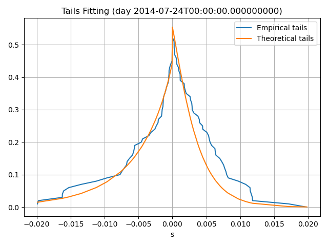
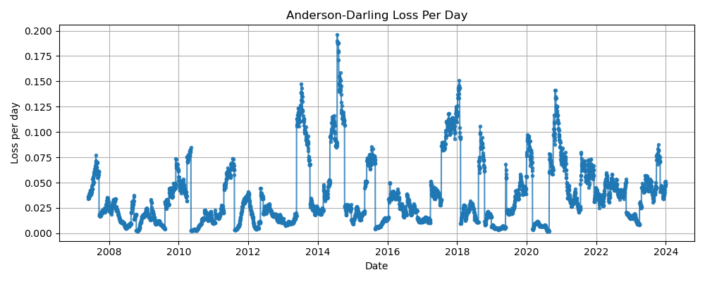
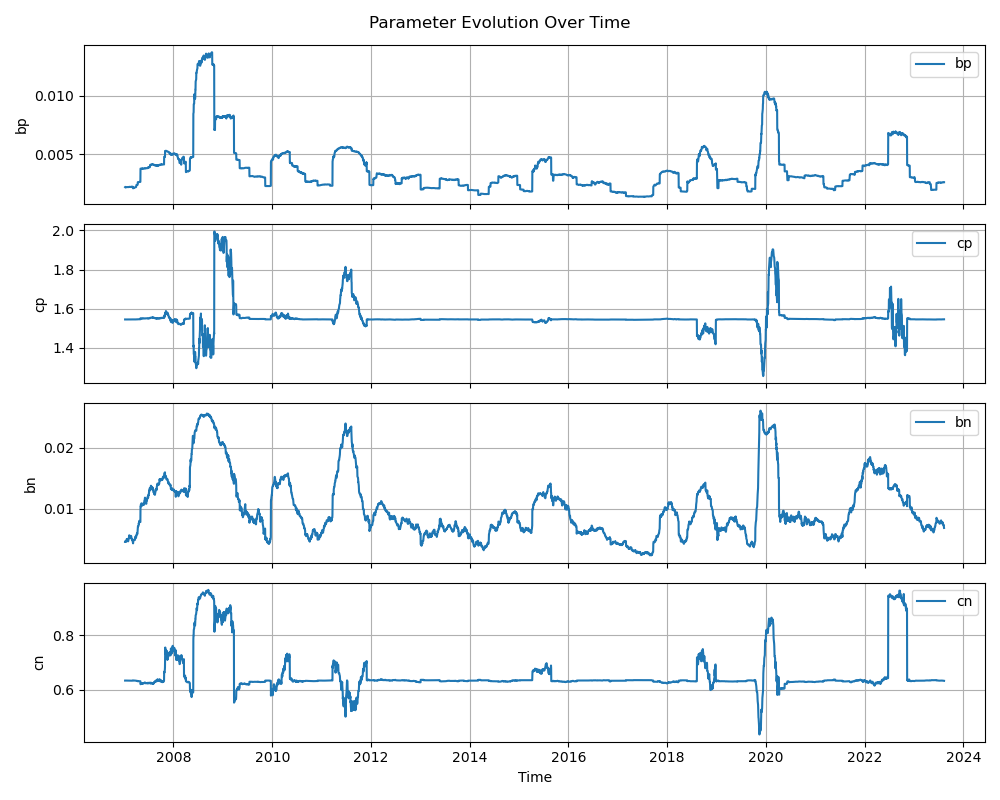
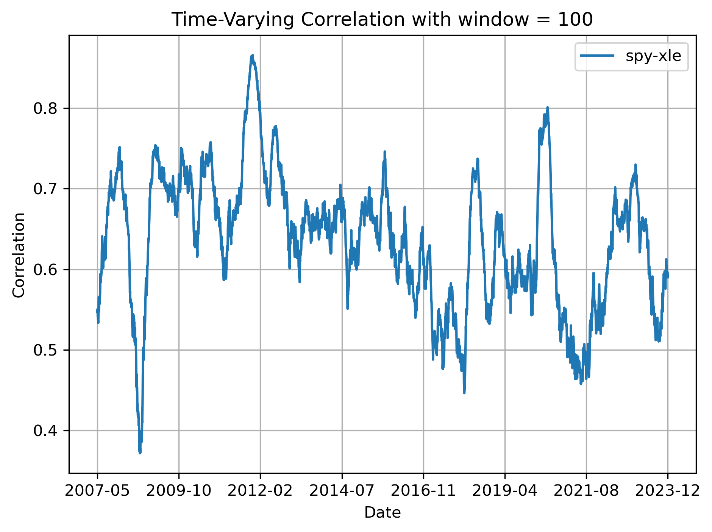

# Modeling Returns Distributions

In this folder a t-copula with Bilateral Gamma (BG) marginals for joint ETFs return distribution is fitted to the asset returns

## Folder Structure

```bash
Modeling/
├── README.md                           # This file - modeling overview
├── BG_Modeling/                        # Bilateral Gamma distribution fitting
│   ├── fit_BG.py                       # Main fitting script
│   ├── fit_BG.ipynb                    # Interactive notebook for BG fitting
│   ├── Models.py                       # BG class definition and methods
│   ├── config.yaml                     # Configuration parameters
│   ├── estimates/                      # Fitted model parameters
│   │   ├── Checkpoints/                # Training checkpoints
│   │   ├── FINAL/                      # Final fitted parameters
│   │   ├── plots/                      # Diagnostic plots
│   │   │   ├── spy_empirical_vs_theoretical_day_worst.png
│   │   │   ├── spy_loss_evolution.png
│   │   │   ├── spy_params_evolution.png
│   │   │   └── ... (plots for other assets)
│   │   ├── spy/                        # SPY-specific estimates
│   │   ├── xlb/                        # XLB-specific estimates
│   │   ├── xle/                        # XLE-specific estimates
│   │   └── .../                        # Other specific estimates
│   └── theta_checkpoints/              # Additional training checkpoints
└── t_Copula_Modeling/                  # t-Copula dependence modeling
    ├── fit_t_Copula.py                 # Main correlation estimation script
    ├── Plot_Correlation_Parms.py       # Visualization of correlations
    ├── t_copula.py                     # t-Copula class implementation
    ├── utils.py                        # Utility functions (Archakov-Hansen, etc.)
    └── results/                        # Fitted correlation matrices and plots
        ├── correlation_matrices/       # Time-varying correlation matrices
        │   ├── corr_matrix_w100.npy   # 100-day window correlations
        │   ├── corr_matrix_w252.npy   # 252-day window correlations
        │   └── ... (other windows)
        └── plots/                      # Correlation visualizations
            ├── corr_over_time_w100.png
            ├── corr_over_time_w252.png
            ├── level_curves_joint_pdf_w100.png
            └── ... (other correlation plots)
```

## Methodology

We model the marginal distribution of each ETF's return using the Bilateral Gamma distribution to capture skewed, heavy-tailed behavior.

Estimation is done via a differentiable tail-matching loss with Anderson–Darling weights.

### Assets Modeled

Fitted ETF distributions include:

SPY, XLB, XLE, XLF, XLI, XLK, XLU, XLV, XLY

Each asset’s return distribution is modeled using a Bilateral Gamma density, calibrated to daily returns. Parameters are stored under BG_Modeling/estimates/.

The estimation procedure features:

+ Autograd-differentiable loss defined in PyTorch

+ Loss is computed via quantile-based scoring

+ Theoretical quantiles are derived from the BG pdf, reconstructed using torch.ifft from analytically known characteristic function

+ Tail-sensitive weighting based on the Anderson–Darling criterion

+ Optimization via Adam, combined with backtracking line search for stability

+ Batch GPU implementation enabling high-throughput calibration:

+ Over 15 years of daily data can be fit in under 15 minutes on standard GPU setups for most ETFs with fine frequency-space grid for FFT routine (-2^14:2^14/300,000:+2^14), ensuring a fine real-space grid for the probability density function approximation

+ Achieves accuracy on par with and often exceeding classical Nelder–Mead optimization (average loss for SPY is ~0.03 against ~0.08)

### Visuals

We include key plots for SPY to illustrate the BG model's calibration quality and dynamic insights:

#### Tail Fit (SPY)

plot comparing empirical vs. fitted MBG quantiles for the day with worst-case fitting



#### Loss Evolution

Weighted loss vs. training batch, showing stable convergence under tail-aware optimization.



#### Theta Evolution (SPY)

Parameter trajectories over training:

+ `(bp, bn)` loosely correspond to **average limit order size**.

+ `(cp, cn)` control the **frequency of market orders**

+ High fluctuations in `(cp, cn)` are observed during systemic stress (e.g., **2008**, **2012**, **2020**), suggesting macro sensitivity of non-professional trading activity



All plots are saved under: BG_Modelling/estimates/plots

## Modeling Dependence with t-Copula

To account for the cross-sectional dependence between sector ETFs, we implemented a time-varying multivariate t-copula model. This method allows for modeling non-linear dependencies and tail dependence, which are commonly observed in financial markets but not captured by standard Gaussian assumptions.

Steps Taken:
Marginal Fit: For each ETF, we used the GPU-accelerated BG model to estimate marginal distributions across a rolling 100-day window.

Estimate Kendall-tau matrix for the ETFs vector on each day

Transform the Kendall-tau to the correlation matrix of the t_Copula based on the formula rho = 2 arcsin(omega)/pi

Validation: Verified that the estimated matrices were positive semidefinite across all 4,330 days in the dataset.

Performance: Full estimation completed in ~25 seconds for 11 ETFs over 4,330 days.

Example: SPY–XLE Correlation Over Time

The plot below shows the estimated correlation between SPY and XLE, which remains high and stable over time, as expected in equity sectors with macroeconomic co-movement:




## Running the Code

### Run fitting for SPY

python BG_Modeling/fit_BG.py --asset SPY --config config.yaml

### Run fitting for t-copula model

python t_Copula_Modeling/fit_t_Copula.py
