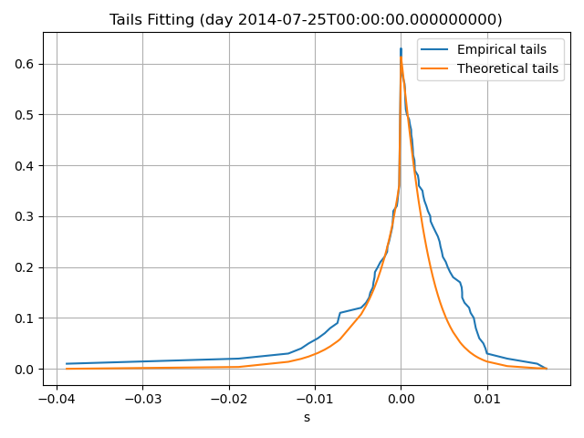

# Multivariate Investments — BG Modeling and Systematic Analysis

This repo implements a t-copula with Bilateral Gamma marginals for joint ETFs return distribution, with a focus on robust, systematic signal extraction.

## Project Structure

```bash
Multivariate-Investments/
│
├── BG_Modeling/
│   ├── fit_BG.py, Models.py      # Core MBG fitting logic
│   ├── config.yaml               # Model + asset config
│   ├── estimates/                # Calibrated MBG parameter files
│   ├── theta_checkpoints/        # Model training checkpoints
│
├── Data/
│   └── tsd180.mat                # Source return data
│
├── Deprecated/                  # Archived experimental code
│
├── MutlivariateFIR.ipynb        # FIR-based signal extraction
├── readme.md                    # This file
```

## Methodology

We model the marginal distribution of each ETF's return using the Bilateral Gamma distribution to capture skewed, heavy-tailed behavior.

Estimation is done via a differentiable tail-matching loss with Anderson–Darling weights.

### Assets Modeled

Fitted ETF distributions include:

SPY, XLB, XLE, XLF, XLI, XLK, XLU, XLV, XLY

Each asset’s return distribution is modeled using a Bilateral Gamma density, calibrated to daily returns. Parameters are stored under BG_Modeling/estimates/.

The estimation procedure features:

+ Autograd-differentiable loss defined in PyTorch

+ Loss is computed via quantile-based scoring

+ Theoretical quantiles are derived from the BG pdf, reconstructed using torch.ifft from analytically known characteristic function

+ Tail-sensitive weighting based on the Anderson–Darling criterion

+ Optimization via Adam, combined with backtracking line search for stability

+ Batch GPU implementation enabling high-throughput calibration:

+ Over 15 years of daily data can be fit in under 15 minutes on standard GPU setups for most ETFs with very fine frequency space for FFT routine (-2^14:2^14/300,000:+2^14), ensuring a very fine real-space grid for the probability density function approximation

+ Achieves accuracy on par with and often exceeding classical Nelder–Mead optimization (average loss for SPY is ~0.03 against ~0.08)

### Visuals

We include key plots for SPY to illustrate the BG model's calibration quality and dynamic insights:

#### Tail Fit (SPY)

plot comparing empirical vs. fitted MBG quantiles for the day with worst-case fitting



#### Loss Evolution

Weighted loss vs. training batch, showing stable convergence under tail-aware optimization.


#### Theta Evolution (SPY)

Parameter trajectories over training:

+ `(bp, bn)` loosely correspond to **average order size**.

+ `(cp, cn)` control the **frequency of market orders**

+ High fluctuations in `(cp, cn)` are observed during systemic stress (e.g., **2008**, **2012**, **2020**), suggesting macro sensitivity of non-professional trading activity


All plots are saved under: BG_Modelling/estimates/plots

## Modeling Dependence with t-Copula

To account for the cross-sectional dependence between sector ETFs, we implemented a time-varying multivariate t-copula model. This method allows for modeling non-linear dependencies and tail dependence, which are commonly observed in financial markets but not captured by standard Gaussian assumptions.

Steps Taken:
Marginal Fit: For each ETF, we used the GPU-accelerated BG model to estimate marginal distributions across a rolling 100-day window.

Probability Integral Transform (PIT): Transformed marginal returns into uniform variables via the BG-fitted CDFs.

t-Inverse Transformation: Converted the uniform samples to pseudo-observations using the inverse t CDF (with 6 degrees of freedom).

Time-Varying Correlation Estimation: Applied the Archakov–Hansen exponential mapping to ensure each day’s correlation matrix is symmetric and positive semidefinite.

Validation: Verified that the estimated matrices were positive semidefinite across all 4,330 days in the dataset.

Performance: Full estimation completed in ~25 seconds for 11 ETFs over 4,330 days.

Example: SPY–XLE Correlation Over Time

The plot below shows the estimated correlation between SPY and XLE, which remains high and stable over time, as expected in equity sectors with macroeconomic co-movement:

## Running the Code

### Set up environment

conda env create -f BG_Modeling/environment.yml
conda activate mbg-env

### Run calibration for SPY

python BG_Modeling/fit_BG.py --asset SPY --config config.yaml

## Future Work

Planned extensions include:

Copula-based joint dependence modeling (Clayton)

Implementation of Dynamic Saddle Programming to solve max-min optimization problem
