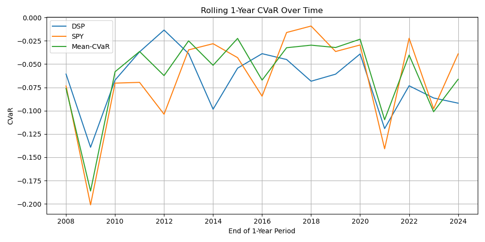
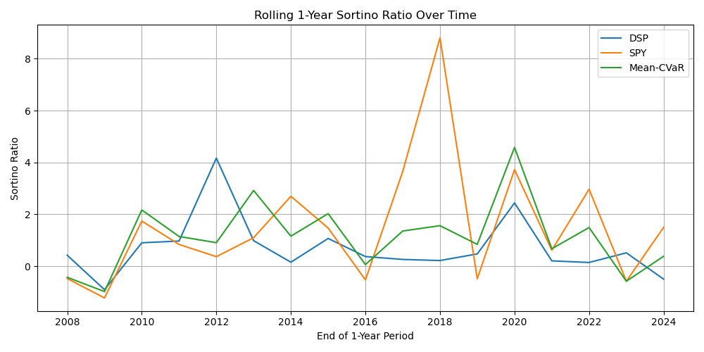

# An End-to-End Pipeline for Systematic Equity Investing

This repo implements a t-copula with Bilateral Gamma (BG) marginals for joint ETFs return distribution, with a focus on robust, systematic signal extraction.

The strategy implemented here is a self-financing variant of the one appeared in the paper [Multiasset Investment](https://papers.ssrn.com/sol3/papers.cfm?abstract_id=5195015) by D. Madan, Y. Shirai and K. Wang, and our aim is to compare it with few benchmark strategies in terms of standard performance measures, such as Sharpe ratio and Max Drawdown.

A non-technical summary of this repo is also available on [medium](https://medium.com/@yoshihiroshirai/a-robust-systematic-equity-strategies-d26ea229bde0).

## About the Author

**Yoshihiro Shirai** is a Pearson Fellow at the University of Washington with expertise in applied mathematics, machine learning, and economics.

-[LinkedIn](<https://www.linkedin.com/in/yoshihiro-shirai/>)

-[Google Scholar](<https://scholar.google.com/citations?user=...>)

-[GitHub](<https://github.com/yshirai999>)

-[Personal Website](<https://www.yoshihiroshirai.com>)

## Project Structure

```bash
Systematic-Equity-Strategies/
│
├── readme.md                      # This file - project overview
├── environment.yml                # Conda environment specification
├── .gitignore                     # Git ignore patterns
├── .git/                          # Git repository files
│
├── Data/                          # Data processing and source files
│   ├── DataProcessing.py          # Basic data class inherited by BG class
│   ├── tsd180.mat                 # Source return data (MATLAB format)
│
├── Modeling/                      # Return distribution modeling
│   ├── readme.md                  # Modeling overview and methodology
│   ├── BG_Modeling/               # Bilateral Gamma distribution fitting
│   │   ├── fit_BG.py              # Main fitting script
│   │   ├── fit_BG.ipynb           # Interactive notebook for BG fitting
│   │   ├── Models.py              # BG class definition and methods
│   │   ├── config.yaml            # Configuration parameters
│   │   ├── estimates/             # Fitted model parameters
│   │   └── theta_checkpoints/     # Additional training checkpoints
│   ├── GANs/                      # Generative Adversarial Networks (experimental)
│   │   └── CMacro-GAN             # Conditional Macro GAN implementation
│   └── t_Copula_Modeling/         # t-Copula dependence modeling
│       ├── fit_t_Copula.py        # Main correlation estimation script
│       ├── Plot_Correlation_Parms.py  # Visualization of correlations
│       ├── t_copula.py            # t-Copula class implementation
│       ├── utils.py               # Utility functions (Archakov-Hansen, etc.)
│       └── results/               # Fitted correlation matrices and plots
│
├── Optimizers/                     # Portfolio optimization methods
│   ├── DSP/                       # Dynamic Saddle Programming
│   │   ├── dsp_solver.py          # General DSP problem class
│   │   ├── constraints_utils.py   # Builds Phi(a) and a-grid
│   │   ├── simulate_joint.py      # Joint return simulation from BG + t-Copula
│   │   └── Tests.ipynb            # Testing and validation notebook
│   └── MeanCVaR/                  # Mean-CVaR optimization
│       └── mean_CVaR_solver.py    # Mean-CVaR optimizer implementation
│
├── Backtesting/                    # Strategy backtesting framework
│   ├── Backtesting.py             # Main backtesting class
│   ├── run_parallel_backtest.py   # Parallel backtest execution
│   ├── analyze_performance.py     # Performance analysis and metrics
│   └── Results/                   # Backtest results storage
│       ├── backtest_results_0_4330_50.npy
│       ├── backtest_results_0_4330_75.npy
│       └── ... (other result files)
│
└── Deprecated/                     # Archived experimental code
```

## Methodology

We model the marginal distribution of each ETF's return using the Bilateral Gamma distribution to capture skewed, heavy-tailed behavior.

Optimal portfolio weights are then constructed by maximizing the worst case expected return with rebates for scenarios that are far from the base case

A systematic strategy is then implemented by rebalancing the portfolio weights every 20 business days based on the maxmin solution

## Results

The DSP strategy shows some advantage in risk-adjusted metrics during the GFC that emphasize downside protection and tail risk control.

In particular: **Rollingm CVaR** and **Max Drawdown** indicate that the DSP portfolio outperforms SPY in terms of downside risk-adjusted return during during the GFC and the sovereign debt crisis (2008-2012), although no similar findings are found during subsequent periods. Performance measures seem to confirm this result.

These results also show a slight, but substantial improvement with respect to Mean-CVaR optimization at 95%






## Running the Code

### Set up environment

```bash
conda env create -f environment.yml
conda activate mbg-env
```

## Future Work

Planned extensions include:

Improve upon the joint return distribution using Generative AI and including macro factors to capture evolving regime switched and volatility clustering phenomena.
